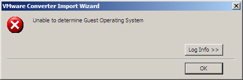

Buenas hacia mucho que no escribía , el trabajo y los estudios me mantiene ocupado.

Voy a reportar el ultimo fallo que he tenido con entorno VMware . Lo primero es hacer referencia a otro blog que da una solución aunque no es completa y no por su culpa. Tenemos un fantástico error el cual tiene varias causas y por tanto varias soluciones , lo malo es que nunca sabemos cual de estos es.

Esta es la ventana del error

La solución aportada por [santib90](https://santib90.wordpress.com/2008/02/13/error-unable-to-determine-guest-operating-system-en-vmware-converter/) esta vinculada a permisos de ejecución , echarle un ojo por si acaso. Si no es vuestro caso probar esta solución.

Si en la maquina virtual tiene un fallo en el fichero boot.ini , no genera problemas en el arranque pero si al recuperar la info sobre el sistema operativo que corre en ella .

boot.ini para Windows XP `[boot loader] timeout=3 default=multi(0)disk(0)rdisk(0)partition(1)WINDOWS [operating systems] multi(0)disk(0)rdisk(0)partition(1)WINDOWS="Microsoft Windows XP Professional" /noexecute=optin /fastdetect` boot.ini para Windows 2003 `[boot loader] timeout=30 default=multi(0)disk(0)rdisk(0)partition(1)WINDOWS [operating systems] multi(0)disk(0)rdisk(0)partition(1)WINDOWS="Windows Server 2003, Standard" /noexecute=optout /fastdetect`
