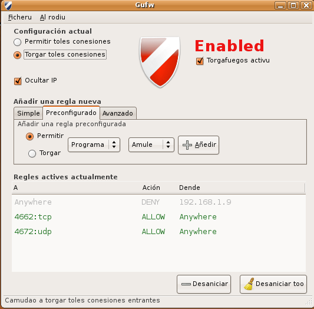

Ubuntu es un gran sistema pero hay veces que no le entiendo. Me he vuelto paranoico con el fin de año , luego se me pasa. Hay que instalarse un firewall y si windows trae uno Ubuntu no puede ser menos. Si es trae de serie el firewall por excelencia de Linux "IPTABLES" , también Ubuntu han dejado patente su política de facilitar las cosas al usuario, desde la Ubuntu 8.04 se incluye Uncomplicated Firewall (ufw) como interfaz de configuración por consola más amigable. Como la administración por consola no es accesible a las masas desarrollaron también GUFW una interfaz grafica

La parte que no entiendo muy bien es porque viene activo y sin ninguna regla , pero bueno psicológicamente sera para no traumatizar al usuario novato.

Como detalle que no he encontrado en la interfaz gráfica es configurar los aspectos relacionados con los logs.

`sudo ufw logging medium`

`sudo ufw logging on/of`

La ruta del log  es `/var/log/messages` y `/var/log/ufw.log`
