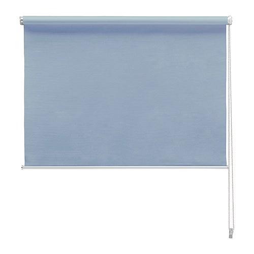

Vaya aventura es hacer bricolaje. Por lo menos para mi , especifico que siempre soy el pinche. Me armé con un taladro , tacos y tornillos hábilmente elegidos mi novia , la entendida en estos menesteres y ataque a las indefensas paredes.

He de decir que ha quedado muy bien y no porque lo haya hecho yo sino porque funcionan !!!!!
