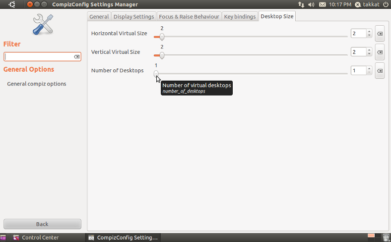

Otra vez con Ubuntu+Unity y con dos pantallas se ha complicado lo de los escritorios virtuales. Ahora se llamas áreas de trabajo "workspaces". Un poco de vergüenza pero he tardado un hora en darme cuenta del nuevo nombre , con escritorios virtuales no aparece nada en Google.

Las áreas de trabajo es estructuran con escritorios virtuales , verticales y horizontales. Muy complicado ya que trabajaremos en escritorio formando cuadrados y es un poco complicado moverte entre ellos. Las opciones que he probado es la de reducir los escritorio verticales para seguir como hasta ahora , pero he simplificado a ningún escritorio virtual.

**¡¡¡ Ya tengo dos pantallas !!!**

Unity no tiene un centro de configuración completo para Compiz así que hay que tirad de varias opciones:

- MyUnity
- CompizConfig Settings Manager
- Configuration Editor

 

### Modificar el numero de escritorio

Lanzado CCSM de terminal o ddes del meú _System Settings -> CompizConfig Settings Manager_:

> **Cuidado :** ccsm puede probocar perdidas de configuraciones irreversibles

Elegimos  _General Options -> Desktop Size_:

Yo he reducido al mínimo posible , con un escritorio me basta y me sobra.

 

### Fuente:

[how-can-i-reduce-or-increase-the-number-of-workspaces-in-unity](https://askubuntu.com/questions/34572/how-can-i-reduce-or-increase-the-number-of-workspaces-in-unity "how-can-i-reduce-or-increase-the-number-of-workspaces-in-unity")
