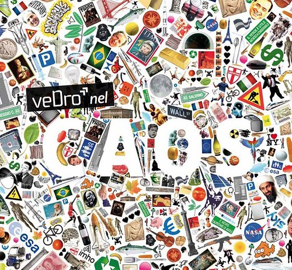

No me acuerdo del termino que se usa para indicar la dependencia de un plugin que ya no se actualiza y entra en conflicto con otros nuevos. Me quedo con la expresión vulgar   "una pu...." . Después de un par de mese desconectado , no he sido capaz de termina ningún post , debo de tener como 10 frentes abiertos. De temáticas variopintas.

 

 foto: [veDrò nel caos](https://www.flickr.com/photos/associazionevedro/6082589579/) - Dro (Tn), 28-31 agosto 2011

Actualmente mi mundo gira alrededor de PowerShell , Java + Maven + Nexus + Eclips + m2e , y el siempre perenne HP Software. Con el tipo de ocio que elijo  no me queda mucho para actualizar el Blog/twitter/facebook
