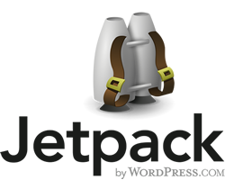

## Nuevas características de Jetpack

Nuestro amigo/enemigo Jetpack

Hoy toca actualización técnica. El blog personal se va optimizando , fuera plugins y personalizaciones en el servidor web.

\[caption id="" align="aligncenter" width="200"\] Logo Jetpack\[/caption\]

He leído las mejoras de Jetpack , principalmente sus detractores más educados. Ahora toca valorar las nuevas mejoras y si realmente son necesarias para un plataforma como esta.

 

\[caption id="" align="alignleft" width="169"\] Jetpack Publicize 2.0\[/caption\]

 

[**Jetpack - Publicize**](https://jetpack.me/support/publicize/ "Jetpack - Publicize")

Creo que ha sido la mejor  y la más esperada , bueno no tenia ni idea del roadmap y ni de una nueva versión del superplugin estuviera en el horno pero han oído mis suplicas.

Cada día que pasaba existían nuevos plugins para socializar la plataforma , "telita con el de facebook" tenia más opciones que páginas el libro gordo de petete. Esto no es asumible dentro del entorno de simplicidad de WordPress. El botón simple de compartir existe pues otro igual para autoplublicar contenido en las redes sociales .

 

 

Respecto al resto de mejoras no me afecta , ahora con [****Jetpack -** Photon**](https://jetpack.me/support/photon/ "Jetpack - Photon") tendremos un servicio de cache de imágenes , pero claro hace años que se recomienda utilizar servicios externos como flickr , dropbox , etc ... en este aspecto la orientación es hacia usuarios inexpertos , o no profesionales que subes la imágenes a su propio servidor.

**[Jetpack - infinite Scroll](https://jetpack.me/support/infinite-scroll/ "Jetpack - Infinite Scroll"). ** Aquí tenemos una moda que odio con todas mis fuerzas "El scroll infinito" esto más las página que se mueven en vertical a toda velocidad para el cambio de sección me dan mareos. Lo malo es que se expande como la pólvora y es una nueva funcionalidad en el superplugin.

**[Jetpack - Post by Emai](https://jetpack.me/support/post-by-email/ "Jetpack - Post by Email").** Publicación por correo electrónico tiene también cabida , un sistema integrado en el core desde las mas tempranas versiones y que nunca he utilizado. Está presente sin lo más básico validar el origen del correo para su publicación , siguen con la idea de una dirección autogenerada para proporcionar seguridad de quien publica. Una brecha de seguridad bastante importante.

Se me ha visto el plumero la única imagen que hay es de _Publicize_ y y eso es porque me parece realmente útil  , sin olvidar la utilización de la Cloud por parte de _Photon_.
