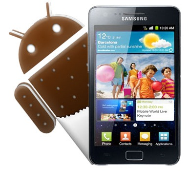

Para este titulo tas escueto hay tanto que decir. En el punto técnico vaya forma de gastar el dinero por parte de las operadoras al genera aplicaciones que son un basura. Desde los usuario tienen smartphones  con muchas aplicaciones y por lo visto eso es bueno , o de más calidad. Desde las personas con más conocimientos técnicos toca trabajar en casa para obtener lo mismo que el fabricante nos quiere dar, una buenísima sensación de uso.

\[caption id="" align="aligncenter" width="387"\] s2 ICS\[/caption\]

Con las nuevas técnicas de la operados se crean nuevas palabras para deshacer sus chapuzas. Ellas quieren dar sensación de marca con la frase _"más aplicaciones propias mejor"_ Debrand es eliminar todas sus personalizaciones.La tecnología es buscar la forma de resolver problemas y uno de los actuales proviene de las aplicaciones inútiles y mal hechas de las operadoras.

Vuelvo a tener mi querida Galaxy SII y claro viene otra vez con todos las "aplicaciones" de Vodafone. Claro todo usuario necesita tener 3 tiendas de aplicaciones , dos de música  y un sin fin de mensajes de la operadora de turno.

Siendo los terminales de Samsung los que más conozco , entender como arreglar este problema  no lleva mas de 5 minutos. En esto terminales siempre se hace todo igual , ¿como que todo igual? .  Hacerse root , actualizar una rom , poner una nueva desde cero.

Lo primero es utilizar el programa  Odin3 y tener los Drivers de Samsung instalados

 

\[box type="info"\] Hacerse root con el Recovery CF-root.tar\[/box\]

\[box type="info"\] Flashear ROM desde cero con un rom completa. Para identificar este tipo de rom se revisan su ficheros y han de tener CSC , APBOOT , CODE y MODE , ademas de la opción de Repartition\[/box\]

\[box type="info"\] Flashear una actualización de un solo fichero HOME si es necesario.\[/box\]

 

 

 

Según la acciona realizar necesitaras mas o menos ficheros
