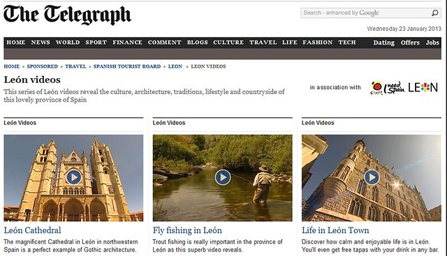
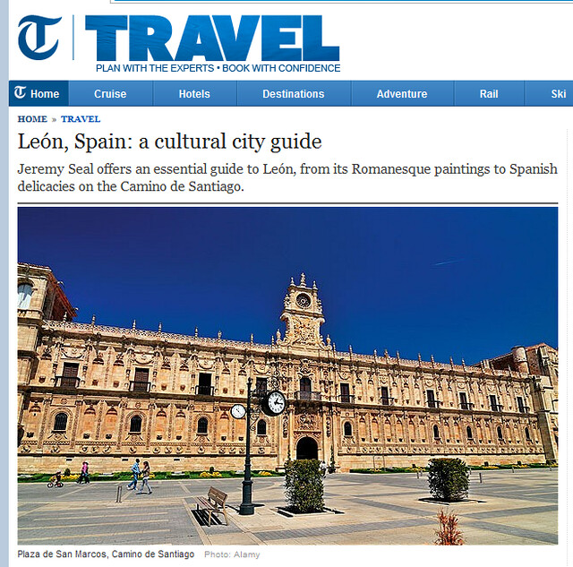
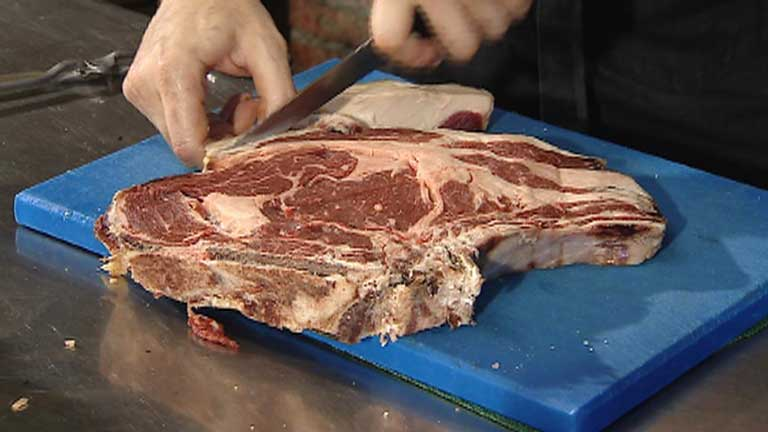

Si  hoy toca recordad al mundo una de esas regiones españolas que no tiene playa  y que su valor histórico y cultural es indescriptible.

Empezando por la ciudad de León , capital de provincia y ciudad descendiente de un asentamiento  romano ....  bueno esas cosas se puede leer en la wikipedia ....

Lo importante  es  la cultura culinaria  , no solo restaurantes con estrella Michelin que los hay,  me refiero a ese tipo de comida de antes. El cocido maragato con su curiosos detalle  o el cocido montañés son un ejemplo claro de aquellos potajes que nos hicieron crecer fuertes en nuestra infancia , de las alubias no tengo tan grato recuerdo.

Recopilo diferentes artículos internacionales en los que se marcan León como un referente turístico y eso que aun no conoces picos de Europa ni el Bierzo ......

[Vídeos de leon en el telegraph](https://www.telegraph.co.uk/sponsored/travel/spanish_tourist_board/leon/leon-videos/ "Videos de leon en el telegraph")

[Guía de León realizada por el diario Telegraph británico](https://www.telegraph.co.uk/travel/9664397/Leon-Spain-a-cultural-city-guide.html# "Leon Spaina cultural- ity guide")

  

 

­

## Según las revistas Time, Life o The Guardian, la mejor carne del mundo está en la provincia de León.

Primero los atemperan y luego loss marcan brevemente a la parrilla. Enormes lomos y chuletas de bueyes viejos que han seducido a la crítica internacional. muchas las publicaciones la consideran la mejor carne del mundo

 

Según las revistas Time, Life o The Guardian, la mejor carne del mundo está en la provincia de León.[**Ver vídeo**](https://www.rtve.es/alacarta/videos/telediario/segun-revistas-time-life-the-guardian-mejor-carne-del-mundo-esta-provincia-leon/1512366/)

- [**Según las revistas Time, Life o The Guardian, la mejor carne del mundo está en la provincia de León.**](https://www.rtve.es/alacarta/videos/telediario/segun-revistas-time-life-the-guardian-mejor-carne-del-mundo-esta-provincia-leon/1512366/ "Según las revistas Time, Life o The Guardian,  la mejor carne del mundo está en la provincia de León.")
