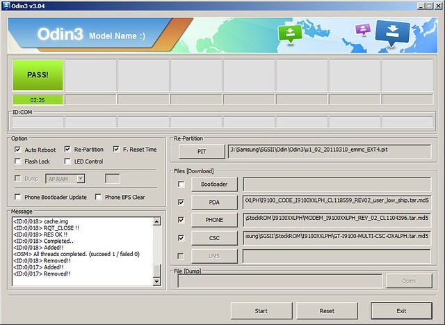
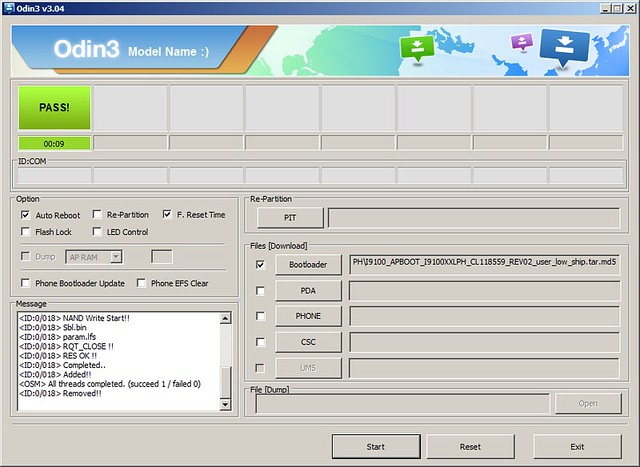

Hoy quiero dejar anotado unas notas sobre los tipos de flasheo y sus características. Siempre que tengo que cambiar la ROM me vuelvo loco buscando información , esta vez va ser la definitiva. Una guía de la "pata" , esta expresión que significa _de lo bueno lo mejor_ a llegado a mí a travez de un ser pe

### Tipos de Flasheo con Odin

- BootLoader
- Actualización/Upgrade
- Completa/Full

Realizar una u otra dependerá del numero de ficheros que forme la ROM que nos descarguemos. Se nos puede presentar varios casos.

- 1  Fichero "\_HOME\_"
- 4  Ficheros "CSC" ," \_MODEM\_" , "\_CODE\_", "PIT"
- 5  Ficheros "CSC" ," \_MODEM\_" , "\_CODE\_" , "\_APBOOT\_" , "PIT"

### Ficheros requeridos según flasheo:

- Bootloade  necesita del \_APBOOT\_
- Actualización/Upgrade necesita un fichero "\_HOME\_"
- Completa necesita de los 4 ficheros "CSC" ," \_MODEM\_" , "\_CODE\_"

### Relación de ficheros  y lugares de colocación en el Odin:

- PIT: ARCHIVO PIT
- PDA= CODE
- PHONE= MODEM
- CSC= CSC
- BootLoader= APBOOT

### Opciones a marcar según flasheo:

- Upgrade
    - Auto Reboot _**Check**_
    - F. Reset Time _**Check**_
    - Re-Partition
- Full
    - Auto Reboot _**Check**_
    - F. Reset Time _**Check**_
    - Re-Partition  _**Check**_
- BootLoader
    - Auto Reboot _**Check**_
    - F. Reset Time _**Check**_
    - Re-Partition

Los procedimientos  varía levente pero no sus resultados finales.

El BootLoader reescribe el sector de arranque incluyendo el "Recovery" oficial de Samsung.

El upgrade no elimina datos personales del teléfono  , solo actualiza el sistema operativo.

El flasheo completo reparticiona el alamcenamiento interno he instala el sistema operativo completo

Conociendo el requerimiento de ficheros , la relación campo con fichero y el resultado final de cada uno , ya se puede elegir cual hacer en cada momento.

### Ejemplos

#### _Como una imagen vale más que mil palabras ,os dejo un par de ejemplos_

El flasheo completo se realiza como indica esta imagen

\[caption id="" align="aligncenter" width="640"\] Odion flasheo completo\[/caption\]

El flasheo del BootLoader se realiza como indica esta imagen

\[caption id="" align="aligncenter" width="640"\] Como configurar Odin para un flasheo del bootloader\[/caption\]

Con esto y un bizcocho podemos componer cualquier flasheo de cualquier StockROM de Samsung.

Fuentes:

- [RamonRamon **poner-a-la-ultima-nuestro-samsung-galaxy-s2-android-4-1-1-jelly-bean**](https://ramonramon.org/blog/2012/08/03/poner-a-la-ultima-nuestro-samsung-galaxy-s2-android-4-1-1-jelly-bean/ "poner-a-la-ultima-nuestro-samsung-galaxy-s2-android-4-1-1-jelly-bean/")
- [HTCMania **Solución paso a paso de un semibrick**](https://www.htcmania.com/showthread.php?t=355993 "Solución paso a paso de un semibrick en muchos de los casos (Galaxy S2 i9100, Galaxy S1 i9000, Galaxy S SCL ... ) Y FLASHEAR ICS 4.0.3 A SGS2 GT-I9100 + CWM + ROOT DESDE RECOVERY ")
- [\[KERNEL\]\[ICS\] **ClockworkMod Recovery 5.5.0.4**](https://forum.xda-developers.com/showthread.php?t=1118693 "[KERNEL][ICS] ClockworkMod Recovery 5.5.0.4")
