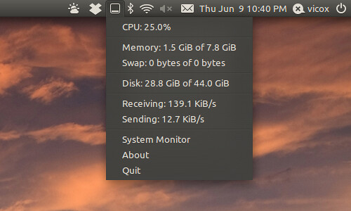

## Syspeek un chivato minimalista

Syspeek se visualiza con  pequeño icono en la barra de sistema  indica el uso de la CPU. es pequeño y muestra más detalle mediante menú desplegable. Realmente solo lo miro cuando se pone rojo , importante cambia de color para indicar el esfuerzo, sencillo a más no poder

\[caption id="" align="aligncenter" width="500"\] Display syspeek\[/caption\]

### Este es el proceso de instalación:

```
sudo add-apt-repository ppa:emptythevoid/syspeeknew && sudo apt-get update && sudo apt-get install syspeek
```

Siempre puedes utilizar synaptic para agregar el repositorio nuevo  e instalar  `syspeek`

## Finalidad

Cumple con lo que quiero  , no ocupa , sencillo de usar  y proporciona la información que necesito. tras la instalación se coloca como aplicación al inicio.
