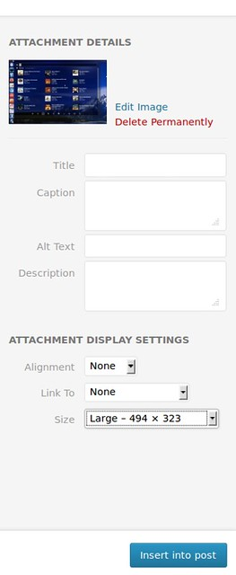
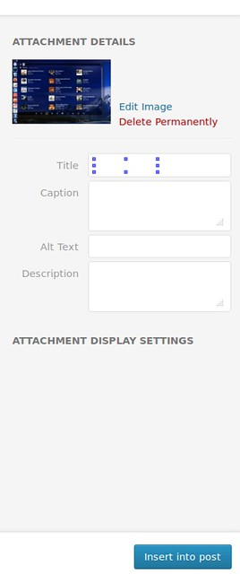

# Uploader Media WordPress

En este punto venimos del anterior post en el que modificábamos el comportamiento del Uploader Media WordPress median el único hook que se mantiene funcionado de versiones anteriores.

En este post entraremos en harina , nada de limpieza y poseí como dicta el eslogan de Wordpress. Tenemos que hacer modificaciones en el Uploader Media WordPress y no tenemos una interfaz de uso estándar (hooks y filtros). Utilizando Backbone.js y JQuery es posible realizar algunas modificaciones y otras no porque no tenemos los nombres de los objetos DOM de dicha pantalla , pero los buscaremos.

Ahora vamos con la parte complicada , se han olvidado dar capacidades de modificación al "Uploader Media WordPress". La opción encontrada se basa en localizar los elementos dentro del DOM y aplicarles la propiedad de ocultos , de paso asignaremos valores por defecto. Los valores que asignamos realmente estamos simulando el uso del ratón , un poco cutre a mi parecer y más para este CMS pero es lo que hay , por ahora.

Con esto localizamos el elemento

this.$el.find('select.link-to')

Valiendonos de objetos le aplicamos el valor nulo con

.val('none');

Dejando como resultado

this.$el.find('select.link-to').val('none');

Aunque decía antes que casi simulábamos el uso del ratón aquí radica la pequeña diferencia. Estamos utilizando los Backbones.js para el acceso a los objetos del DOM así que siguiendo sus directrices debemos actualizar los valores del modelo de datos. Para eso siemplemnte aplicamos valores a los objetos que deseamos , atributo "link" con valor "none"

this.model.set('link', 'none');

Esta me ha costado algo más de entender Localizamos el objeto , ascendemos a su padre y a este le aplicamos el oculto. Esto es así para ocular la etiqueta el input que estan contenido en una capa.

this.$el.find('select.link-to').parent('label').hide();

Seguimos desgranando el código con esto tan curioso. Podemos ocultar opciones del elemento HTML select

this.$el.find('select.size option\[value=full\]').hide();

Lo ultimo y no menos importante , guardar los cambios realizados

this.updateLinkTo();

var \_AttachmentDisplay = wp.media.view.Settings.AttachmentDisplay;
	wp.media.view.Settings.AttachmentDisplay = \_AttachmentDisplay.extend({
		render: function() {
			\_AttachmentDisplay.prototype.render.apply(this, arguments);
			this.$el.find('select.link-to').val('none');
			this.model.set('link', 'none');
			this.$el.find('select.link-to').parent('label').hide();
			this.$el.find('select.size option\[value=full\]').hide();
			this.model.set('size', 'large');
			this.updateLinkTo();

### El antes y el después en imagenes

 

